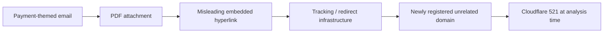

# Phishing Investigation Case Study

A sanitized technical case study of a payment-themed phishing email that passed standard email-authentication checks but used a misleading PDF hyperlink and a redirect chain to an unrelated, newly registered domain.

> **Status:** Sanitized portfolio case study. Organization names, recipient details, sender-identifying information, raw tracking tokens, and internal mailbox data have been removed.

## Why this case matters

The message passed SPF, DKIM, and DMARC. That did **not** make it trustworthy.

The investigation showed an important distinction:

- SPF/DKIM/DMARC can show that a message was authorized by a domain or sending infrastructure.
- They do not prove that the sender, campaign, linked content, or destination is benign.

The malicious behavior became clear only after inspecting the attachment and the URL chain.

## Investigation summary

The email presented itself as a payment-remittance notification and included a PDF attachment. Static analysis of the PDF showed that the link displayed to the recipient did not match the link actually embedded in the document.

Remote URL analysis then showed that the link passed through tracking/redirect infrastructure before terminating at:

`secure[.]businessresourcecollaboration[.]com/citrix-receiver/Windows/`

At the time of analysis, the destination domain was approximately 17 days old and the server returned a Cloudflare `521 Web server is down` response. Because the destination was unavailable, the final payload or credential-harvesting behavior could not be confirmed.

## Attack path observed



## Investigation workflow

1. Preserved the original `.eml` instead of relying on a forwarded copy.
2. Reviewed the message headers and authentication results.
3. Inspected MIME structure and the attached PDF.
4. Extracted the embedded hyperlink without clicking it locally.
5. Compared the displayed link with the actual embedded destination.
6. Submitted the URL for remote analysis to observe redirects safely.
7. Recorded the effective destination, domain age, network behavior, and response state.
8. Assessed recipient exposure and recommended containment actions.

## Key findings

| Finding | Result |
|---|---|
| SPF | Pass |
| DKIM | Pass |
| DMARC | Pass |
| Sending platform | Legitimate third-party email delivery infrastructure |
| Attachment | PDF payment/remittance lure |
| Displayed URL vs embedded URL | Mismatch |
| Redirect behavior | Multiple redirects before final destination |
| Final domain | `businessresourcecollaboration[.]com` |
| Domain age at analysis | ~17 days |
| Final response | Cloudflare 521 |
| Confirmed recipient click | No |
| 2FA on recipient account | Enabled |

## Evidence

A sanitized remote-analysis screenshot has been prepared for this case. It is being kept out of the repository until the final public-disclosure review is complete so that no tracking token or organization-specific detail is accidentally published.

The technical observations from that evidence are documented in [`analysis/url-analysis.md`](analysis/url-analysis.md).

## Repository structure

```text
.
├── README.md
├── analysis/
│   ├── email-header-analysis.md
│   ├── pdf-analysis.md
│   └── url-analysis.md
├── indicators/
│   └── iocs.md
├── methodology/
│   └── investigation-workflow.md
└── SECURITY-NOTES.md
```

## Defensive mapping

This case is consistent with the following MITRE ATT&CK techniques from a defender-analysis perspective:

- **T1566.001 – Phishing: Spearphishing Attachment**: the lure arrived as an email with a PDF attachment.
- **T1204.001 – User Execution: Malicious Link**: the attack depended on the recipient following a link embedded in the PDF.

These mappings describe the observed delivery and user-execution path only. The unavailable destination prevented confirmation of any later-stage technique.

## Main lesson

A green SPF/DKIM/DMARC result should not end an investigation. Authentication results must be interpreted together with sender context, attachment behavior, URL destinations, domain reputation, redirect chains, and user exposure.

## Safety and disclosure

This repository does **not** contain the raw `.eml`, original PDF, recipient address, organization name, unique tracking token, mailbox logs, or a clickable malicious URL. Indicators are defanged where appropriate.

The case study is published for defensive security education and portfolio purposes.
